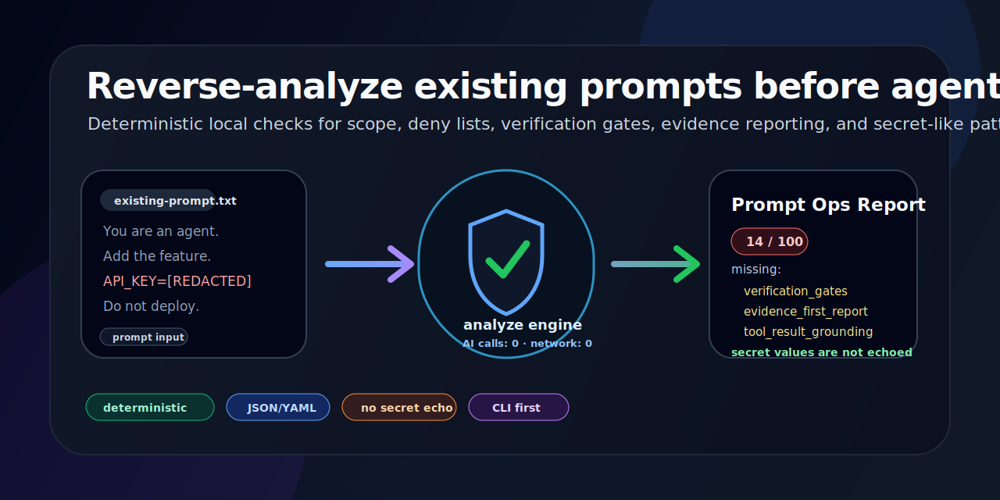

<p align="center">
  
</p>

<p align="center">
  <a href="https://www.python.org/"></a>
  <a href="LICENSE"></a>
  <a href="#security-first-reverse-analysis"></a>
  <a href="#security-first-reverse-analysis"></a>
  <a href="#what-it-produces"></a>
  <a href="https://modelcontextprotocol.io"></a>
</p>

<p align="center">
  <a href="README-ko_kr.md">한국어</a> ·
  <a href="#quick-start">Quick start</a> ·
  <a href="#fable-5-alignment-features">Fable 5 features</a> ·
  <a href="#security-first-reverse-analysis">Analyze prompts</a> ·
  <a href="#security-boundary">Security boundary</a>
</p>

<p align="center">
  
</p>

# prompt-ops-maker

**AI agents ship better when the prompt includes scope, deny lists, verification gates, and a result-first report format. Those rules are easy to forget when every project uses a different model or runtime.**

`prompt-ops-maker` generates reusable operating prompts for Claude Fable 5-style long tasks, Claude, Codex, Hermes, MCP agents, Gemini, and generic AI agents.

> One command. Project config or preset in. Verification-focused agent prompt out.

---

## One-line result

```text
prompt-ops-maker = prompt generator and local analyzer for agent scope + safety boundaries + verification gates
```

## Security-first reverse analysis

Existing prompts often miss the operational rules that keep AI agents safe during long tasks. The `analyze` command checks those rules locally before the prompt is reused.

```bash
prompt-ops-maker analyze --input existing-prompt.txt --format text
prompt-ops-maker analyze --input existing-prompt.txt --format json --output analysis.json
```

Example report shape:

```text
# Prompt Ops Analysis — existing-prompt.txt

Score: 14/100

## Summary
- Present checks: 2
- Missing checks: 5
- Secret-like patterns: 1 detected
- Source policy: deterministic local heuristics; no AI call; no secret value echo

## Missing / Risk Items
- [BLOCKER] secret_literal_risk
- [HIGH] deny_list
- [HIGH] verification_gates
- [MEDIUM] evidence_first_report
- [MEDIUM] tool_result_grounding

## Checks
- Execution boundary: present (BLOCKER)
- Unverified item reporting: present (MEDIUM)
- Verification gates: missing (HIGH)
```

The analyzer uses deterministic local checks only. It does not infer private infrastructure and does not print detected secret values.

## Why this exists

Agent tasks fail in repeatable ways:

```text
Problem                                    What breaks
No execution boundary                      Agent edits, deploys, or uploads before approval
No verification gate                       Generated prompt is mistaken for completed work
No target-runtime context                  Claude, Codex, MCP, and CI receive the same vague prompt
No deny list                               Secrets, customer data, and env values can leak into output
No result-first report format              Long logs hide blockers and unverified items
No project preset                          Every audit/fix/deploy prompt is rewritten from scratch
```

These are not model problems only. They are operating-system problems for AI work. `prompt-ops-maker` packages the missing rules into prompts that can be reused across projects and agents.

It does **not** claim Fable 5-equivalent model performance. It reuses Fable 5 prompting-guide patterns as model-agnostic prompt operations: effort level, execution boundaries, verification gates, evidence-first reporting, and explicit unverified-item reporting.

## What it produces

```text
Input                    Output
────────────────────────────────────────────────────────────────────────────
Project YAML config      A project-aware agent prompt
Type preset              An ad-hoc agent prompt without a project config
Existing prompt file     Reverse-analysis for missing ops boundaries
Task description         Concrete objective and risk focus
Target AI                Claude / Codex / Hermes / MCP / Gemini / generic guidance
Runtime environment      local / mcp / discord / ci / browser / api instructions
Effort level             low / medium / high / xhigh behavior
Deny list                Actions the agent must not take without approval
Verification gates       Commands, files, URLs, or evidence the agent must check
Report sections          conclusion, evidence, BLOCKER/HIGH/MEDIUM/LOW, unverified items
```

## Usage

### Install from GitHub

```bash
git clone https://github.com/verisworks-ai/prompt-ops-maker.git
cd prompt-ops-maker
python3 -m pip install -e '.[test]'
prompt-ops-maker list-types
```

### Direct script use

```bash
python3 prompt_ops_maker.py list-projects
python3 prompt_ops_maker.py list-types
```

`fable5_prompt_maker.py` remains as a compatibility wrapper for older local workflows.

## Quick start

### Project prompt

```bash
prompt-ops-maker make \
  --project mobile-miniapp \
  --mode ad-qa \
  --task "Ad integration QA" \
  --effort high \
  --target-ai codex \
  --environment local \
  --dry-run
```

### Ad-hoc prompt without a project config

```bash
prompt-ops-maker make-adhoc \
  --name "Webhook monitor" \
  --type automation-pipeline \
  --task "Operational audit" \
  --risk "duplicate runs, secret output, failed alerts" \
  --effort high \
  --target-ai hermes \
  --environment mcp \
  --dry-run
```

### Analyze an existing prompt

```bash
prompt-ops-maker analyze \
  --input existing-prompt.txt \
  --format text
```

This reverse-analysis mode uses deterministic local checks only. It does not call an AI model, does not infer private infrastructure, and does not echo detected secret values. It reports missing execution boundaries, deny lists, verification gates, unverified-item handling, and evidence-first reporting.

Structured output is available for automation:

```bash
prompt-ops-maker analyze --input existing-prompt.txt --format json --output analysis.json
prompt-ops-maker analyze --input existing-prompt.txt --format yaml --output analysis.yaml
```

### Save a prompt file

```bash
prompt-ops-maker make \
  --project brand-hub \
  --mode seo-geo \
  --task "Public search and AI citation audit" \
  --effort high \
  --target-ai claude \
  --environment discord \
  --output outputs/brand-hub-seo-geo.md
```

## Example output

```text
# DRY RUN — mobile-miniapp / ad-qa / high / codex / local

You are the Mobile Miniapp ad QA agent.

이번 작업은 high effort로 진행해.
대상 AI/실행자: Codex
실행 환경: Local CLI
수정하지 말고 광고 연동 상태만 평가해.

검증 게이트:
1. Bundle artifact output 확인
2. Full-screen ad load/show 경로 확인
3. 실제 테스트 결과와 미검증 항목 분리

금지:
- 파일 수정
- 콘솔 변경
- live 광고 ID 반복 테스트
- secret 출력

보고 형식:
첫 문장은 사용자가 가장 궁금해할 결과 하나만 말해.
내부 추론은 쓰지 말고, 결론 / 확인한 증거 / 미검증 항목만 보고해.
```

## Built-in modes

```text
Mode       Purpose
────────────────────────────────────────────────────────────────────────────
audit      Launch and operations audit
fix        Approved minimal fixes
deploy     Release or upload readiness checks
ad-qa      Ads integration QA
seo-geo    Search, GEO, and AI citation readiness
appsec     Public/private/security boundary audit
ux         User flow and mobile UX audit
```

## Built-in targets

```text
Target    Use when
────────────────────────────────────────────────────────────────────────────
fable5    Claude Fable 5-style long-task prompt structure
claude    General Claude workflow
codex     Code implementation, tests, and verification
hermes    Hermes Agent skill/tool/gateway environment
mcp       MCP tool/resource/prompt environment
gemini    Research, drafts, and comparison analysis
generic   Generic AI agent
```

## Built-in environments

```text
Environment  Evidence focus
────────────────────────────────────────────────────────────────────────────
local        Local CLI, files, git, tests
mcp          MCP tools, resources, and prompts
discord      Discord status and result reporting
ci           CI/CD logs and artifacts
browser      Browser and UI verification
api          API/server verification
generic      Generic runtime
```

## Type presets

```text
Preset               Use case
────────────────────────────────────────────────────────────────────────────
generic              Generic task
automation-pipeline  Scheduler, batch, alert, webhook operations
web-public           Public web service readiness
mobile-miniapp       WebView, miniapp, SDK, ads bundle readiness
```

## Project configs

Add a private YAML file under `configs/<project>.yaml`, or publish sanitized examples under `configs/examples/<project>.yaml`:

```yaml
project:
  name: "Example Service"
  type: "web-public"
  root: "/path/to/public-web-service"
  domain: "https://example.com"
  agent_role: "Example Service audit agent"
  description: "Public web service example."

core_focus:
  - "Public page UX"
  - "robots.txt, sitemap.xml, JSON-LD"

verification_gates:
  - "Run tests"
  - "Check live HTTP status"

forbidden:
  - "Unapproved deploy"
  - "Secret output"
```

Then run:

```bash
prompt-ops-maker make --project example --mode audit --task "Launch audit" --effort high --dry-run
```

## Practical scenarios

### Before a release — force evidence before claims

```bash
prompt-ops-maker make \
  --project brand-hub \
  --mode deploy \
  --task "Production release gate" \
  --effort xhigh \
  --target-ai codex \
  --environment ci \
  --dry-run
```

Use this when a project needs source checks, build output checks, live smoke checks, and explicit approval boundaries.

### For MCP agents — separate tool output from final claims

```bash
prompt-ops-maker make-adhoc \
  --name "MCP server audit" \
  --type automation-pipeline \
  --task "Check available tools, permissions, and side effects" \
  --risk "credential leakage, tool side effects" \
  --target-ai mcp \
  --environment mcp \
  --dry-run
```

### For Claude or Gemini — keep drafts from becoming fake verification

```bash
prompt-ops-maker make-adhoc \
  --name "Market research handoff" \
  --type generic \
  --task "Compare options and list unverified assumptions" \
  --target-ai gemini \
  --environment generic \
  --dry-run
```

## Fable 5 alignment features

Three additions close the gap between a well-structured prompt and a prompt that forces consistent behavior across model families.

### `--self-verify` — 9-item self-assessment rubric

Appends a structured self-check block to the generated prompt. The model scores itself on 9 items before declaring completion.

```bash
prompt-ops-maker make-adhoc \
  --name "Webhook monitor" \
  --type automation-pipeline \
  --task "Operational audit" \
  --target-ai fable5 \
  --self-verify \
  --threshold 90 \
  --max-iterations 2 \
  --dry-run
```

Rubric items: execution boundary, deny list, verification gates, unverified reporting, evidence-first report, tool result grounding, assumption surfacing, adversarial check, confidence calibration.

A model that fails the rubric will retry (up to `--max-iterations`) before reporting done. Fable 5 actually reworks the output; smaller models tend to rubber-stamp ✓.

### `--promptspec` — YAML mission spec

Outputs a structured YAML spec alongside the prompt. Useful for passing structured context to orchestrators, codex-hermes, or MCP tools.

```bash
prompt-ops-maker make-adhoc \
  --name "SEO audit" \
  --type web-public \
  --task "Launch readiness check" \
  --target-ai fable5 \
  --promptspec \
  --dry-run
```

Spec fields: `version`, `target_ai`, `sub_agents`, `verification_gates`, `checkpoint_schedule`, `self_verify`.

### `run --agentic` — eval-driven validation loop

Run a generated prompt against eval cases and measure pass rate. Failures are logged to `feedback/failures.jsonl` and lessons are appended to `.prompt-ops/lessons.md`.

```bash
# evals/cases.yaml example:
# - label: "exec boundary present"
#   input: "Does this prompt have an execution boundary?"
#   expect: "승인"
# - label: "deny list check"
#   input: "Are there forbidden actions?"
#   expect: "금지"

prompt-ops-maker run \
  --prompt outputs/my-prompt.md \
  --evals evals/cases.yaml \
  --model haiku \
  --threshold 80 \
  --agentic \
  --record-lessons
```

Returns exit 0 if pass rate ≥ threshold, exit 1 otherwise. Use in CI to gate prompt quality before committing.

### Cross-model verifier

Independent verification via any model family — Claude, GPT, or Gemini via the proxy API.

```bash
# Verify with multiple models independently:
prompt-ops-maker verify --input my-prompt.md --verifier-model haiku
prompt-ops-maker verify --input my-prompt.md --verifier-model gpt-mini
prompt-ops-maker verify --input my-prompt.md --verifier-model gemini

# Available aliases: haiku, sonnet, fable5, opus, gpt-mini, gpt, gpt5, codex, gemini, gemini-pro
```

Routes Claude models to `/v1/messages` and GPT/Gemini to `/v1/chat/completions` through `localhost:8317` (proxy).

### Fable 5 vs smaller models — gap table

The prompt structure works with any model. What differs is how strictly the structure is followed:

```text
Structure          Fable 5                            Haiku / Sonnet / GPT-mini
──────────────────────────────────────────────────────────────────────────────────────
execution_boundary Semantically understood — refuses   Treats it as one rule among many.
                   out-of-scope work explicitly.       Scope creep on long contexts.

verification_gates Actual checkpoint. FAIL → diagnose  Rubber-stamp: declares "PASS"
                   → retry.                            without checking. No retry loop.

9-item self-verify Checks output against each item.    All-pass bias. Quality degrades
                   Self-detected errors → retry.       for later items in the list.

promptspec YAML    Respects nested constraints and      Reflects top 2-3 fields. Deep
                   cross-field interactions.            fields ignored. Schema drift.

run --agentic      Multi-step state maintained. Error   Same action retried infinitely.
                   → root cause → different approach.   Plan forgotten after ~5 steps.
                                                        Early "done" declaration.

recovery           FAIL → root cause analysis → new    Retry same failed action.
                   strategy.                           No recovery strategy.
```

The structure is model-agnostic. The execution quality scales with model reasoning depth.

## v2: Layered Cognition

v2 introduces a 6-layer chain that makes violations structurally impossible, not just discouraged.

```text
Layer  Name          What it enforces
──────────────────────────────────────────────────────────────────────────────
L0     Scope         Task boundary and deny list — agent cannot drift outside
L1     Evidence      All findings must have evidence_ids — no claim without proof
L2     Analyze       Structured analysis against collected evidence only
L3     Hypothesize   Ranked hypotheses, each tied to L1 evidence
L4     Critique      Adversarial review of L3 hypotheses before surfacing
L5     Report        Result-first report: conclusion → evidence → BLOCKER/HIGH → unverified
```

Evidence IDs are required at the schema level. A finding without `evidence_ids` cannot be serialized — the gate is code, not instructions.

### MCP server (v2)

```bash
cd mcp_server
python3 -m uvicorn server:app
```

Four tools: `analyze_prompt`, `generate_prompt`, `list_types`, `get_layer_chain`  
Two resources: `layer_specs`, `service_ontology`  
One prompt: `ops_workflow`

### Model adapters

```text
Adapter   Tuning
──────────────────────────────────────────────────
claude    Extended thinking, evidence-first report
codex     Code + test verification gates
gemini    Research / comparison analysis
hermes    Skill/tool/gateway environment
generic   No model-specific tuning
```

## Architecture

```text
prompt-ops-maker/
├── prompt_ops_maker.py          ← public CLI entry
├── fable5_prompt_maker.py       ← compatibility wrapper
├── core/
│   ├── layers.py                ← LayerSpec model, CHAIN_ORDER
│   ├── composer.py              ← layer + adapter → prompt render
│   └── validator.py             ← JSON schema gate (code, not LLM)
├── adapters/                    ← claude/codex/gemini/hermes/generic
├── mcp_server/server.py         ← FastMCP 4 tools + 2 resources + 1 prompt
├── configs/
│   ├── layers/                  ← L0_scope.yaml ~ L5_report.yaml
│   ├── examples/
│   │   ├── mobile-miniapp.yaml
│   │   ├── public-real-estate-service.yaml
│   │   └── brand-hub.yaml
│   └── _types/
├── schemas/                     ← evidence_ledger / findings / critique JSON schemas
├── tests/test_prompt_maker.py
├── service-ontology.json        ← service ontology manifest
├── examples/README.md
└── docs/ontology-notes/README.md
```

## Verification

```bash
python3 -m pytest -q
python3 prompt_ops_maker.py list-projects
python3 prompt_ops_maker.py list-types
python3 prompt_ops_maker.py make --project brand-hub --mode audit --task 'smoke test' --effort high --target-ai codex --environment local --dry-run
python3 prompt_ops_maker.py analyze --input README.md --format json
```

Current release smoke:

```text
pytest                         13 passed, 1 skipped
list-projects                  examples/brand-hub, examples/mobile-miniapp, examples/public-real-estate-service
list-types                     automation-pipeline, generic, mobile-miniapp, web-public
self-verify dry-run            appends 9-item rubric block
promptspec dry-run             outputs YAML spec
run --agentic                  runs eval cases, writes failures.jsonl
verify --verifier-model gpt-mini  LLM-based independent score
```

## Security and privacy boundary

- Do not store API keys, tokens, private keys, customer data, or full `.env` values in configs.
- Use placeholder paths in examples.
- Treat generated prompts as instructions, not proof that the target project was verified.
- Keep deploy, upload, database, and account-setting changes behind explicit approval.
- Secret values should never appear in generated prompts or reports.

## Requirements

Python 3.10+

## License

MIT — [veris](https://veris.kr) · [hello@veris.kr](mailto:hello@veris.kr)
